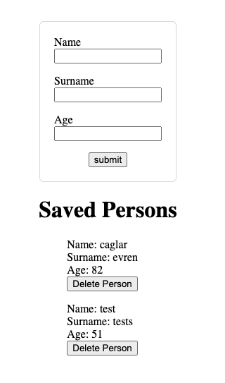

# Form Project using JSON Server(Get, Post, Delete)

In this project my aim was creating a basic form project. I used Vue.js(Class Based), TypeScript.
 
 

## Installation

---

- Step 1: You need to run &nbsp; `npm install`
- Step 2: Then you need to run &nbsp; `json-server db.json`
- Step 3: After that open a new terminal and run `npm run serve -- --port 3000`

---

